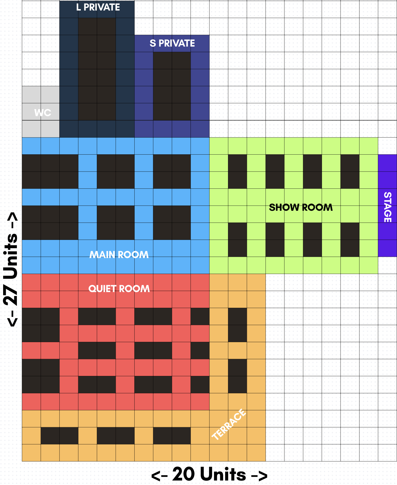

# Smart Booking System

## Prerequisites

The application is containerized using Docker.
Following tools need to be installed on your system to run the app:
- Docker
- Docker Copmose (included with Docker Desktop)

[Install Docker Desktop](https://www.docker.com/products/docker-desktop/)

## Running the App

Clone the repository and start the containers:
```bash
git clone https://github.com/andersaa1/smart-booking-system.git
cd smart-booking-system
docker compose pull
docker compose up -d
```
After the containers start, the application will be available at:
* Frontend: http://localhost:3000
* Backend API: http://localhost:8080/api

Open http://localhost:3000 in your browser to access the application. </br>
Use the app on full screen for intended experience.

## Architecture Overview

The application consists of two separate modules:

- backend - Spring Boot 
- frontend - React + TypeScript

## Floor Plan
The layout of the restaurant might change in the future. The mock-restaurant floor plan consists of eight different zones, five of which include tables that can be reserved. These zones are:
* **Main Room:** Loudest and busiest section in the restaurant, which offers seats for 4 - 6 customers. Meant for families and get-togethers.
* **Quiet Room:** The most mellow and quiet section in the restaurant that includes a separate bar and offers seats for 2 - 4 customers. Meant for dates and magical nights.
* **Terrace:** Outdoor section of the restaurant, which offers seats for up to 2 customers. Meant for warm summer days and clear starry nights.
* **Show Room:** Section of the restaurant which includes a stage for performers and special events and offers seats for up to 2 customers. This section might not be available at all times.
* **Special Rooms:** Two secluded rooms in the restaurant, where the larger room offer seats for up to 12 customers and the smaller room offers seats for up to 8 customers. Meant for private birthdays and other celebrations.
* **Additional Rooms:** Extra rooms where table reservations are not available and are meant to boost the customer experience. These rooms are two bathrooms, a stage and a bar.
</br>



## Endpoints
The backend of the application has four endpoints in total managed by three controllers.

### Fetching Tables
Endpoint used for fetching tables and their position on the floor plan grid. A request is made whenever the website is accessed to render tables and their labels on the floor plan. This endpoint also supports multiple optional query parameters. These parameters are not currently used by the frontend application but are available for future extensions.</br>
**Request:**
```bash
GET /api/tables
```
**Response:**
```JSON
[
    {
        "id": 3,
        "zone": "MAIN",
        "tableGroup": "C",
        "totalSeats": 4,
        "preferences": [
            "NONE"
        ],
        "layout": {
            "col": 9,
            "row": 11,
            "width": 2,
            "height": 2
        }
    },
]
```
**Optional Parameters**
This endpoint supports multiple optional query parameters which can be chained together.
* `zone={Zone}`: Filters by zone, has to be uppercased. Multiple zones can be filtered by separating them with commas.
* `totalSeats={integer}`: Filters by total seats.
* `minSeats={integer}`: Filters tables that have at least minSeat seats.
* `maxSeats={integer}`:Filters tables that have no more than maxSeat seats.
* `preferences={Preference[]}`: Filters tables that have at least one specified preference.

### Fetching Reserved Tables
Endpoint for fetching table ID's which are reserved during the chosen date & time. A request is made whenever the website is accessed to differentiate reserved tables from un-reserved tables with different colors on the floor plan. This endpoint supports couple optional query parameters.</br>
**Request:**
```bash
GET /api/reservation
```
**Response:**
```JSON
{
    "datetime": "2026-03-12T15:22:43.30055",
    "reservedTableIds": [
        1,
        6,
        11,
        12
    ]
}
```
**Optional Parameters**
This endpoint supports two optional query parameters, one of which is a dummy and doesn't serve any purpose.
* `datetime={DateTime}`: Date & time in ISO format, used to get reserved tables for that date. Defaults to current date if not specified.
* `durationMinutes={integer}`: Duration of the reservation. This parameter doesn't do anything at current state.

### Fetching Recommended Tables
Endpoint for fetching recommended tables. Request body is mandatory for this endpoint, but the fields can be left as null, in that case they will get default values. A request is made to this endpoint whenever the **'Get Recommendations'** button is pressed.</br>
**Request:**
```bash
POST /api/recommendations
```
**Request Body:**
```JSON
{
    "datetime": "2026-03-12T15:22:43.30055",
    "partySize": 2,
    "preferences": ["BAR", "STAGE"]
}
```
* datetime defaults to `DateTime.now()`
* partySize defaults to 1
* preferences defaults to an empty list

**Response:**
```JSON
[
    {
        "TableId": 7,
        "score": 3
    },
]
```
### Adding New Reservations
Endpoint for adding new reservations. Request body is mandatory for this endpoint and all the fields have to be filled in. This endpoint is called whenever a reservation is created throught the frontend application.</br>
**Request:**
```bash
POST /api/reservation
```
**Request Body:**
```JSON
{
    "datetime": "2026-03-12T15:22:43.30055",
    "name": "Juhan",
    "email": "juhan@hotmail.ee",
    "partySize": 4,
    "tableId": 19
}
```
**Response:**
```JSON
Table QUIET-E reserved.
Reservation Information:
Date & Time: 2026-03-12T15:22:43.30055
Name: Juhan
Email: juhan@hotmail.ee
```

## Code Quality

The project enforces consistent code quality rules in both the backend files and frontend files.

### Frontend
Frontend code quality is handled with:
- **ESLint** for linting
- **Prettier** for formatting

Linting rules are defined in [eslint.config.js](/frontend/eslint.config.js). </br>
Formatting rules are defined in [.prettierrc](/frontend/.prettierrc). </br>
</br>
Linting and formatting are applied to only `.ts` and `.tsx` files.

### Backend
Backend code quality is handled with:
- **Checkstyle** for linting
- **Spotless** with **google-java-format** for formatting

Linting rules are defined in [checkstyle.xml](/backend/config/checkstyle.xml).

### Local Commands
Frontend:
```bash
cd frontend
npm run lint:check
npm run lint
npm run format:check
npm run format
```
Backend:
```bash
cd backend
./mvnw checkstyle:check
./mvnw spotless:check
./mvnw spotless:apply
```

## CI/CD Pipeline
GitHub Actions is used to run code quality checks on every push and pull request to the `main` branch.
</br>
The pipeline contains four jobs:
* frontend lint
* backend lint
* frontend format
* backend format

### Lint and Format Jobs
The pipeline only validates the code, by executing `...:check` commands. Formatting fixes must be applied locally before pushing changes.

## Bugs & Issues
Known bugs and planned features are tracked in the GitHub issue tracker. </br>
</br>
To view all planned features and bugs, see the [Issue Tracker](https://github.com/andersaa1/smart-booking-system/issues).

## Author
Ander Saarniit